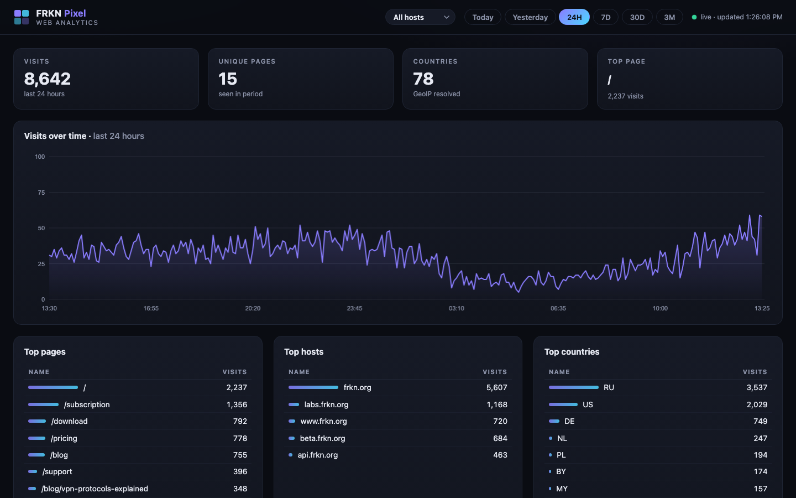
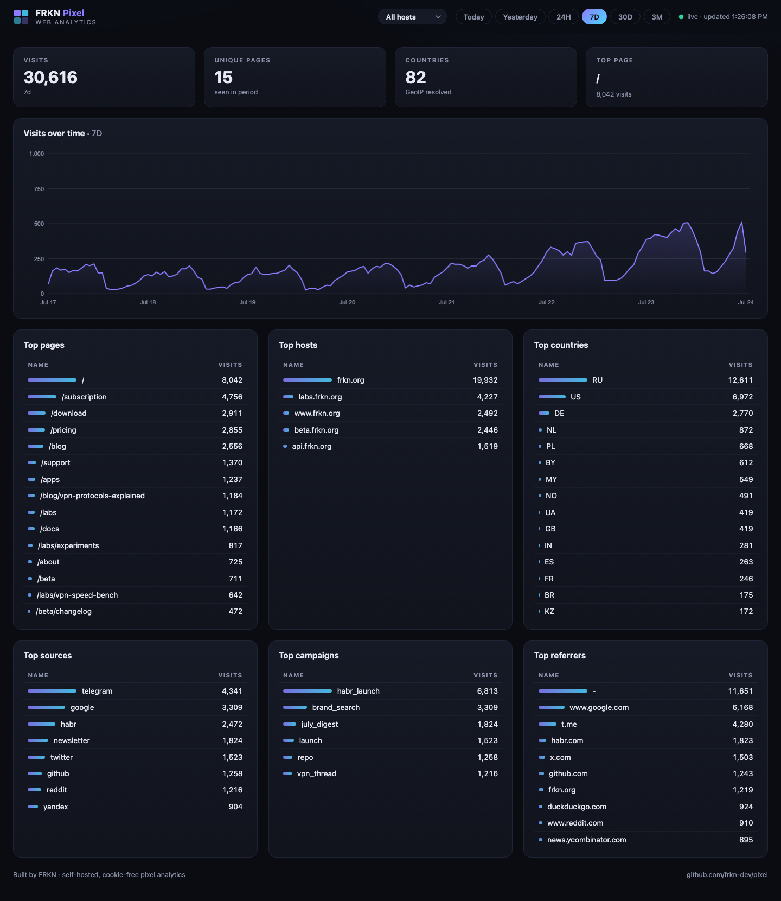
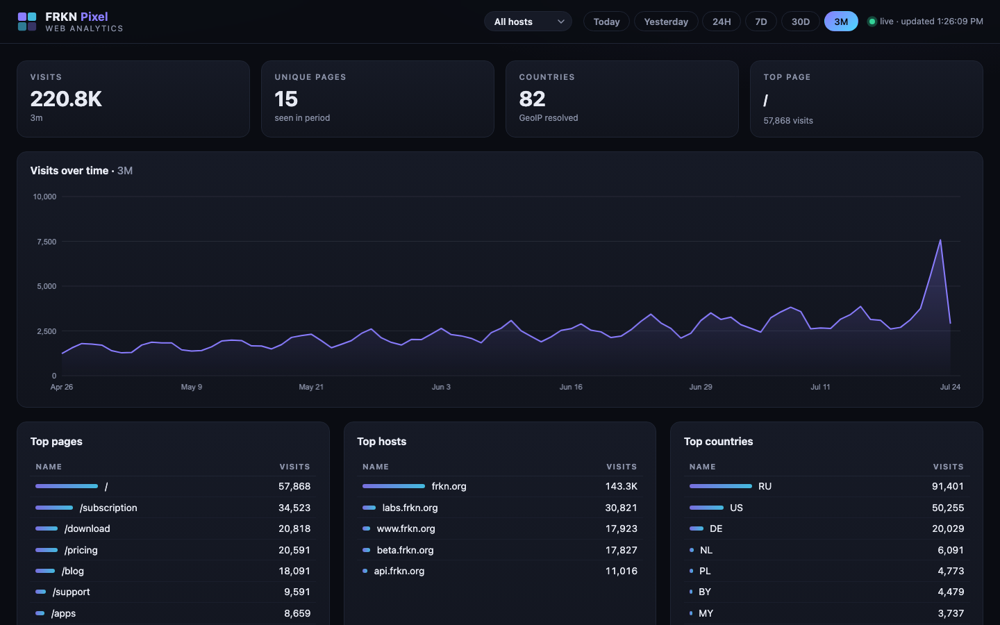
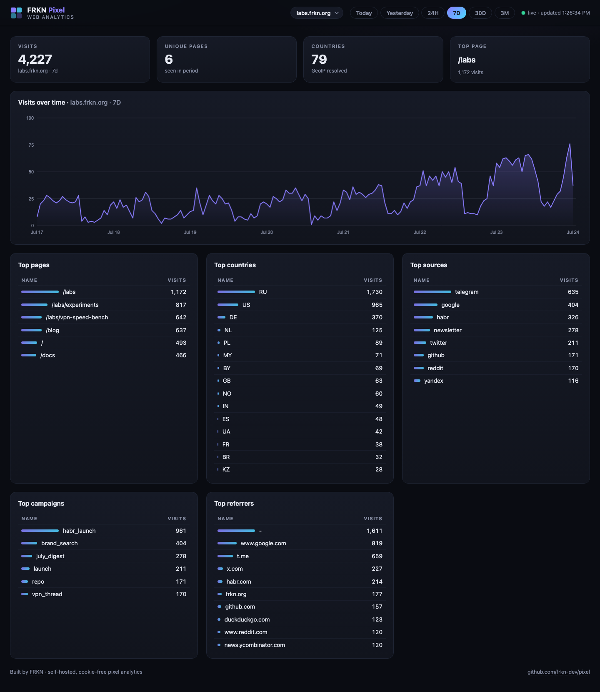
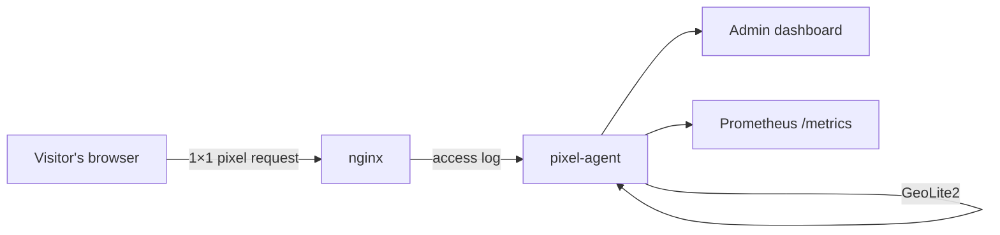

<div align="center">
  

  # FRKN Pixel

  **Self-hosted, cookie-free web analytics in a single Rust binary.**

  No database. No cookies. No JavaScript bundle on the client — just a 1×1 pixel,
  an nginx log, and a dashboard that answers *"who visited my site, from where, and why?"*

  [](https://github.com/frkn-dev/pixel/actions/workflows/build.yml)
  [](https://github.com/frkn-dev/pixel/releases)
  [](LICENCE.txt)
  [](https://github.com/frkn-dev/pixel/stargazers)

  
</div>

## Why Pixel?

Google Analytics is a 400 KB tracker that feeds your visitors' data to an ad company.
FRKN Pixel is the opposite:

- **Privacy-first** — a transparent 1×1 GIF request. No cookies, no fingerprints, no personal data, GDPR-friendly by design.
- **You own the data** — everything lives in one snapshot file on your server. Nothing leaves your infrastructure.
- **Absurdly light** — a ~2 MB static Rust binary with zero runtime dependencies. No ClickHouse, no Postgres, no Redis.
- **Free geo** — visitor countries resolved locally from a GeoLite2 database.
- **Ops-friendly** — Prometheus `/metrics` endpoint out of the box, systemd units, musl static builds.

## Dashboard

Time ranges: **Today · Yesterday · 24H · 7D · 30D · 3M** — switchable in one click, shareable via URL hash.

| 7 days, all tables | 3 months trend |
| --- | --- |
|  |  |

The dashboard tracks:

- **Visits over time** — interactive chart with hover tooltips
- **Per-host analytics** — filter the whole dashboard by host (`frkn.org`, `labs.frkn.org`, …)
- **Top pages / hosts** — what content actually gets read
- **Top countries** — GeoIP-resolved visitor geography
- **Top sources & campaigns** — full `utm_source` / `utm_medium` / `utm_campaign` attribution
- **Top referrers** — who sends you traffic

### Per-host analytics

Running several sites or environments through one pixel? Pick a host in the
header and every card, chart and table shows only that host's data — switch
back to *All hosts* for the global view. The selection lives in the URL hash
(`#7d/labs.frkn.org`), so filtered views are shareable links.



Hosts are listed via config — nothing is hardcoded:

```toml
dashboard_hosts = ["frkn.org", "labs.frkn.org", "beta.frkn.org"]
```

Leave it empty and the list is built automatically from the hosts seen in the data.

## How it works



1. Your page loads a tracking pixel: `GET /pixel?page=/pricing&host=example.com&ref=...&lang=en&utm_source=telegram`
2. nginx writes the request to its access log — that's the only "ingestion pipeline".
3. `pixel-agent` tails the log, parses each hit, resolves the country via GeoIP and aggregates everything into 5-minute buckets.
4. The built-in dashboard and Prometheus endpoint serve the aggregated metrics. State is persisted to a compact [rkyv](https://rkyv.org) snapshot, so restarts are instant and lossless.

Because the source of truth is a plain nginx log, you can **rebuild the entire history at any time** with the backfill tool — see [BACKFILL_README.md](BACKFILL_README.md).

## Tracking snippet

```html

```

UTM parameters from the page URL are forwarded automatically when you use the
helper script — see [`dev/analytics.js`](dev/analytics.js) for a production example.

## Quick start

```bash
# 1. Build (or grab a static musl binary from Releases)
cargo build --release --bin pixel-agent

# 2. Configure
sudo mkdir -p /etc/pixel-agent
sudo cp pixel-agent-example.toml /etc/pixel-agent/config.toml
sudo $EDITOR /etc/pixel-agent/config.toml

# 3. GeoIP database
sudo mkdir -p /usr/share/GeoIP
curl -fsSL -o /usr/share/GeoIP/GeoLite2-Country.mmdb \
  https://raw.githubusercontent.com/adysec/IP_database/main/geolite/GeoLite2-Country.mmdb

# 4. Run
sudo cp target/release/pixel-agent /usr/local/bin/
sudo cp pixel-agent.service /etc/systemd/system/
sudo systemctl daemon-reload
sudo systemctl enable --now pixel-agent
```

The dashboard is now on `http://your-server:9102/` — put it behind nginx with
auth (see [`docs/nginx.conf`](docs/nginx.conf)) and you're done.

One-command deploy of a released version:

```bash
sudo ./deploy/pixel-agent-deploy.sh v0.2.0
```

## Configuration

All options with defaults — see [`pixel-agent-example.toml`](pixel-agent-example.toml):

| Option | Default | Description |
| --- | --- | --- |
| `log_path` | — | nginx pixel log to tail |
| `geoip_db` | — | path to GeoLite2 Country `.mmdb` |
| `admin_listen` / `admin_port` | `0.0.0.0` / `9102` | dashboard & API bind address |
| `bucket_minutes` | `5` | aggregation granularity |
| `retention_hours` | `2160` (90 days) | how long aggregated history is kept |
| `max_points` | `30000` | max data points per metric series |
| `snapshot_path` | `/var/lib/pixel-agent/metrics.snapshot` | persistent state file |
| `poll_interval_sec` | `30` | log tail interval |
| `cors_origins` | `["http://localhost:8080"]` | allowed API origins |
| `dashboard_hosts` | `[]` (auto from data) | hosts shown in the dashboard host filter |

> **Note:** ranges up to *3 months* need the matching retention — the defaults
> above already cover it. If you lower `retention_hours`, long ranges in the UI
> will simply show less history.

## HTTP API

| Endpoint | Description |
| --- | --- |
| `GET /` | admin dashboard |
| `GET /api/metrics?from_ms=…&to_ms=…` | raw time-series JSON for any range |
| `GET /api/config` | dashboard UI config (host filter list) |
| `GET /metrics` | Prometheus exposition (last 24h sums) |
| `GET /health` | health check |

## Backfill

Rebuilding stats from rotated logs (plain or `.gz`):

```bash
pixel-agent-backfill /etc/pixel-agent/backfill.toml /var/log/nginx/pixel.log.1.gz
```

Details and the periodic systemd timer: [BACKFILL_README.md](BACKFILL_README.md).

## Tech stack

Rust 2021 · warp · tokio · dashmap · rkyv · nom · maxminddb · chrono — and a
single dependency-free HTML file for the dashboard, embedded into the binary.

---

<div align="center">
  Built with ❤️ by <a href="https://frkn.org"><b>FRKN</b></a> ·
  <a href="https://github.com/frkn-dev">github.com/frkn-dev</a>
</div>
